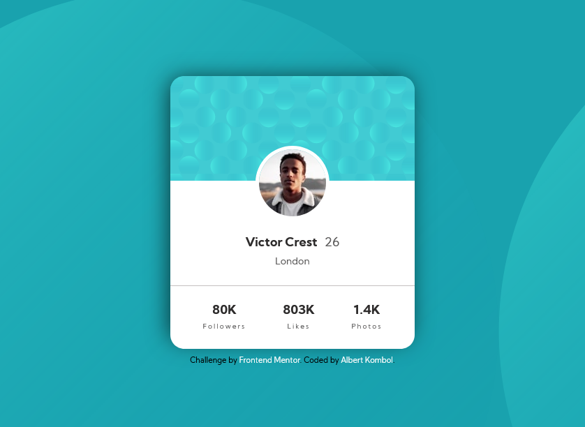

# Frontend Mentor - Profile card component solution

This is a solution to the [Profile card component challenge on Frontend Mentor](https://www.frontendmentor.io/challenges/profile-card-component-cfArpWshJ). Frontend Mentor challenges help you improve your coding skills by building realistic projects. 

## Table of contents

- [Overview](#overview)
  - [The challenge](#the-challenge)
  - [Screenshot](#screenshot)
  - [Links](#links)
- [My process](#my-process)
  - [Built with](#built-with)
  - [What I learned](#what-i-learned)
  - [Continued development](#continued-development)
  - [Useful resources](#useful-resources)
- [Author](#author)

## Overview

### The challenge

- Build out the project to the designs provided

### Screenshot

### Links

- Solution URL: [https://github.com/kalush89/profile-card-component-main](https://github.com/kalush89/profile-card-component-main)
- Live Site URL: [https://profile-card-component-main-kalush89.vercel.app/](https://profile-card-component-main-kalush89.vercel.app/)

## My process

### Built with

- Semantic HTML5 markup
- CSS custom properties
- Flexbox
- CSS Grid
- Mobile-first workflow

### What I learned

Learnt how to combine CSS Grid and Flexbox to create a layout

### Continued development

Wish to focus on the combination of CSS Grid and Flexbox in future projects

### Useful resources

- [CSS Grid starter layouts](https://css-tricks.com/snippets/css/css-grid-starter-layouts/) - This provided a CSS Grid layout boilerplate. I really liked this pattern and will use it going forward.

## Author

- Frontend Mentor - [@kalush89](https://www.frontendmentor.io/profile/kalush89)

